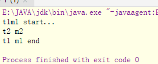

## 静态锁

```java
 public static void mm(){
        synchronized (T.class){ //这里写synchronized(this)是否可以?
            count--;
        }
    }
```

this是指当前对象，静态方法是通过类调用的方法，不需要实例化，既然不需要实例化，就没有当前对象，既然没有当前对象，就不会有this，所以上述代码不能用this。

## 同步和非同步方法是否可以同时调用

```java
class T {
    public synchronized void m1(){
        System.out.println(Thread.currentThread().getName()+"m1 start...");
        try {
            Thread.sleep(10000);
        } catch (InterruptedException e) {
            e.printStackTrace();
        }
        System.out.println(Thread.currentThread().getName()+" m1 end");
    }

    public void m2(){
        try {
            Thread.sleep(5000);
        } catch (InterruptedException e) {
            e.printStackTrace();
        }
        System.out.println(Thread.currentThread().getName()+" m2");
    }

    public static void main(String[] args) {
        T t=new T();
        new Thread(()->t.m1(),"t1").start();
        new Thread(()->t.m2(),"t2").start();
        
        /*new Thread(t::m1,"t1").start();
        new Thread(t::m2,"t2").start();*/
    }
}
```



​		可以。同步方法需要得到锁才能执行，非同步方法不需要得到锁就可以执行。